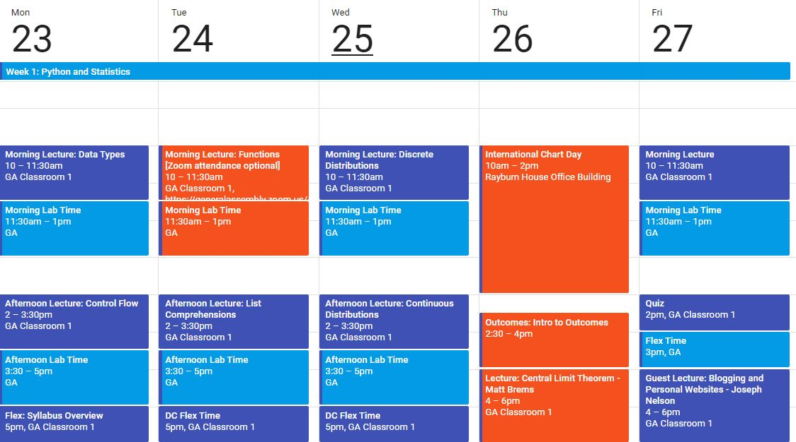

# DSI-US-4-DC Week 1

## Resources:
If you'd like, Slack me with some basic resources that have helped you with Week 1 material.

## General Resources:
- [Chris Albon](https://chrisalbon.com/) has a ton of good info
- Bookmark or save these [cheatsheets](https://medium.com/ai%C2%B3-theory-practice-business/top-6-cheat-sheets-novice-machine-engineers-need-5ea43d1be3de). (I'll print off the Jupyter Notebook cheat sheet.)

### Python
- [learnpython.org](https://www.learnpython.org/). This is the simplest and best one-stop-shop for getting started with Python, in my opinion. Study the first two sections and the 'list comprehensions' lesson from the 'advanced' section.
- Jake VanderPlas' [**A Whirlwind Tour of Python**](https://github.com/jakevdp/WhirlwindTourOfPython)
- [Long notebook full of beginner-to-advanced Python, Numpy, and Regex tips](https://www.kaggle.com/shikhar1/numpy-python-and-regex-tutorial). Don't expect to know all of this!
- [List Comprehensions: Explained Visually](http://treyhunner.com/2015/12/python-list-comprehensions-now-in-color/)

### Git
- Code School's [Git Tutorial](https://www.codeschool.com/courses/try-git)

### Probability and Statistics
Here are some great visual resources:
- Brown's 'Seeing Theory' website is amazing. [Here](http://students.brown.edu/seeing-theory/basic-probability/index.html)'s chapter one.
- [Animation](http://blog.vctr.me/posts/central-limit-theorem.html) of the Central Limit Theorem
- [Visual explanation](http://setosa.io/conditional/) of conditional probability. More relevant for Bayes week!

Probability and Statistics Cheat Sheets:

- Confused by notation? Check [this](https://www.rapidtables.com/math/symbols/Statistical_Symbols.html) out.
- VERY exhaustive [Probability and Statistics Cookbook](http://pages.cs.wisc.edu/~tdw/files/cookbook-en.pdf)
- Slight less intimidating but still overly exhaustive [Probability Cheatsheet](https://static1.squarespace.com/static/54bf3241e4b0f0d81bf7ff36/t/55e9494fe4b011aed10e48e5/1441352015658/probability_cheatsheet.pdf)

## Announcements

- I'd like to book a 1-on-1 with each of you during the first week. Vist my [you can book me](https://ben-shaver.youcanbook.me) link to grab a spot!
- We are taking a 'field trip' on Thursday to attend **International Chart Day** on Capitol Hill. You should already have registered [here](https://www.eventbrite.com/e/international-chart-day-panels-reception-registration-44333634093). Let me know if you have any trouble registering or if you are worried about being able to be at the Rayburn House Office Building at 10am on Thursday.
- ~~There will be a **fire drill at 10:30 am on Tuesday**! You are welcome to come to campus, but if you'd rather not miss 30 minutes of lecture, **you may join the global lecture remotely via the Zoom app**.~~ Download the app [here](https://www.zoom.us/). The "Zoom room" ID for every East Coast lecture is `178-107-556`. I will be taking attendance whether you choose to attend in person or remotely. Normally, you are NOT allowed to attend global lectures remotely unless you have my prior permission.

## Google Calendar Snapshot
Current as of 4/21/18:

