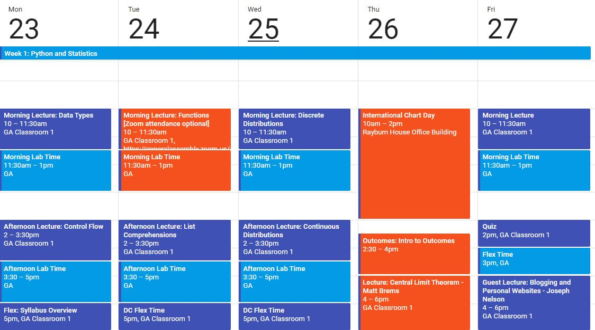

# DSI-US-4-DC Week 1

## Resources:
- [learnpython.org](https://www.learnpython.org/)
- [Long notebook full of beginner-to-advanced Python, Numpy, and Regex tips](https://www.kaggle.com/shikhar1/numpy-python-and-regex-tutorial)

## Announcements

- I'd like to book a 1-on-1 with each of you during the first week. Vist my [you can book me](https://ben-shaver.youcanbook.me) link to grab a spot!
- We are taking a 'field trip' on Thursday to attend **International Chart Day** on Capitol Hill. You should already have registered [here](https://www.eventbrite.com/e/international-chart-day-panels-reception-registration-44333634093). Let me know if you have any trouble registering or if you are worried about being able to be at the Rayburn House Office Building at 10am on Thursday.
- ~~There will be a **fire drill at 10:30 am on Tuesday**! You are welcome to come to campus, but if you'd rather not miss 30 minutes of lecture, **you may join the global lecture remotely via the Zoom app**.~~ Download the app [here](https://www.zoom.us/). The "Zoom room" ID for every East Coast lecture is `178-107-556`. I will be taking attendance whether you choose to attend in person or remotely. Normally, you are NOT allowed to attend global lectures remotely unless you have my prior permission.

## Google Calendar Snapshot
Current as of 4/21/18:

